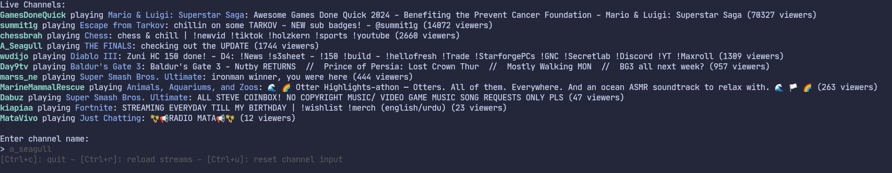

# Chatterm

Twitch chat in the terminal, with moderator actions.

### Features

- View and send messages.
- Built-in authentication via Twitch.
- Ban & timeout users, clear chat, query user info
- Username autocomplete on `@` mentions and `/` commands, triggered by pressing tab.

### Tech Used
- Bubble Tea for the terminal UI
- Gorilla WebSocket for the websocket connection
- SQLite for storage
- Viper for configuration

### Installation

Cloning option (requires Go):
1. `git clone https://github.com/zigzter/chatterm.git`
2. `cd chatterm`
3. `go build .`
4. `./chatterm`

Downloading binary option:
Simply download the binary and run `./chatterm`

### Supported Commands
- Ban a user: `/ban username`
- Timeout a user: `/ban username timeInSeconds`
- Clear chat: `/clear`
- Get a user's info: `/info username`

### Todo:

- [x] Connect to Twitch channel
- [x] Add ability to send chats
- [x] Store Oauth and username in a local config
- [ ] Customize chat output (show/hide badges, colors for first chatters, etc)
- [ ] Query user info
- [ ] Handle network drops
- [ ] Allow saving chat to file
- [ ] Allow searching chat
- [ ] Find a better method of rendering chats
- [x] Perform moderator actions (currently only ban/timeout & clear chat)

