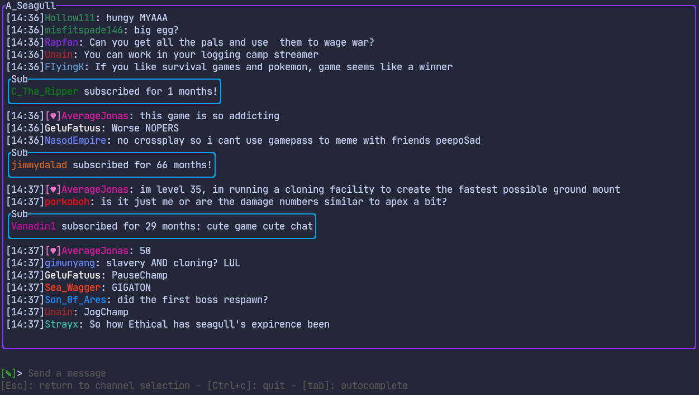
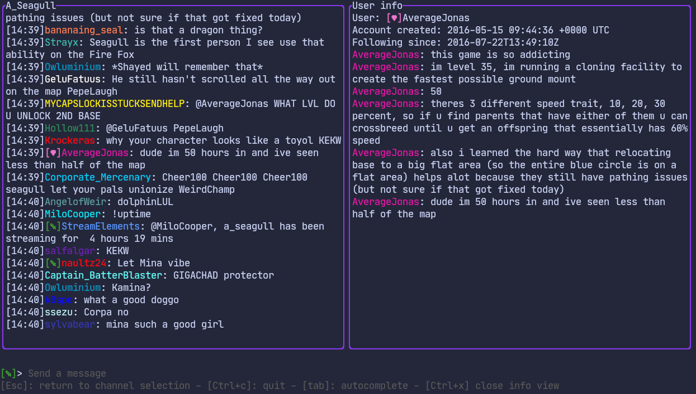

# Chatterm

Twitch chat in the terminal, with moderator actions.

### Features

- View and send messages.
- Built-in authentication via Twitch.
- Ban & timeout users, clear chat, query user info
- Username autocomplete on `@` mentions and `/` commands, triggered by pressing tab.

### Tech Used
- Bubble Tea for the terminal UI
- Gorilla WebSocket for the websocket connection
- SQLite for storage
- Viper for configuration

### Supported Platforms
Currently only tested on Linux. macOS might work if you build it yourself.

### Installation

Cloning option (requires Go):
1. `git clone https://github.com/zigzter/chatterm.git`
2. `cd chatterm`
3. `go build --tags "fts5" .`
4. `./chatterm`

If you have to re-auth for whatever reason, and the oauth request gets stuck loading, try removing the connection from Twitch Connections, then retry the auth.

Downloading binary option:
Simply download the binary and run `./chatterm`

### Supported Commands
- Ban a user: `/ban username`
- Timeout a user: `/ban username timeInSeconds`
- Clear chat: `/clear`
- Get a user's info: `/info username`
- Enable/disable shield mode: `/shield on|off`
- Watch a user (highlight their messages): `/watch username`
    - To remove the user, re-run the command
    - You can also manually edit the `$HOME/.config/chatterm.json` file to add/remove users under the `watched-users` key

