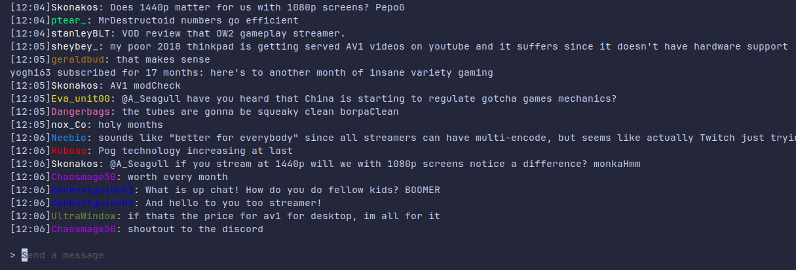

# Chatterm

Twitch chat in the terminal, with moderator actions. Using Bubble Tea for the terminal UI, Gorilla WebSocket for the connection, SQLite for storage & Viper for the config.

Current flow (requires Go if cloning):

1. Either clone and `go build .`, or download the binary under releases
2. Run `./chatterm`, follow prompt to open auth and input username and start auth process.
3. Once submitted, it should bring you back to the channel input view. Enter a channel to join and press enter.
4. To timeout a user, type `/ban username timeInSeconds`. To ban the user, just leave out the time (`/ban username`).

Todo:

- [x] Connect to Twitch channel
- [x] Add ability to send chats
- [x] Store Oauth and username in a local config
- [ ] Customize chat output (show/hide badges, colors for first chatters, etc)
- [ ] Allow saving chat to file
- [ ] Allow searching chat
- [ ] Find a better method of rendering chats
- [x] Perform moderator actions (currently only ban/timeout)

